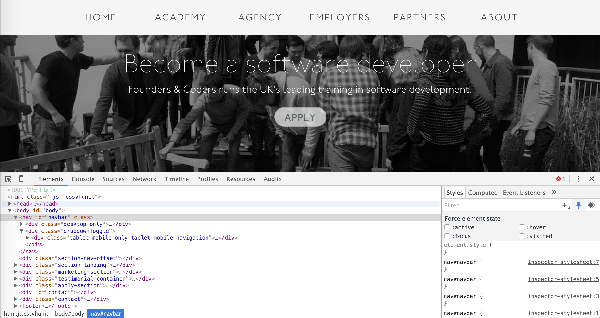
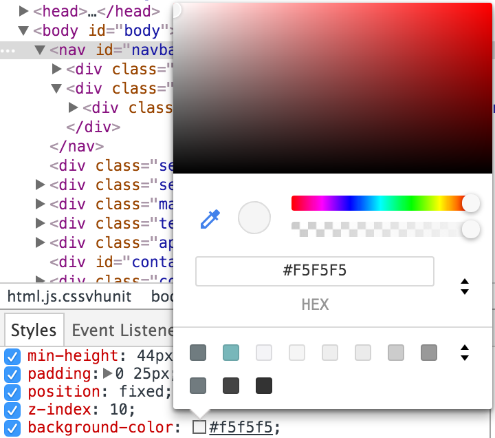
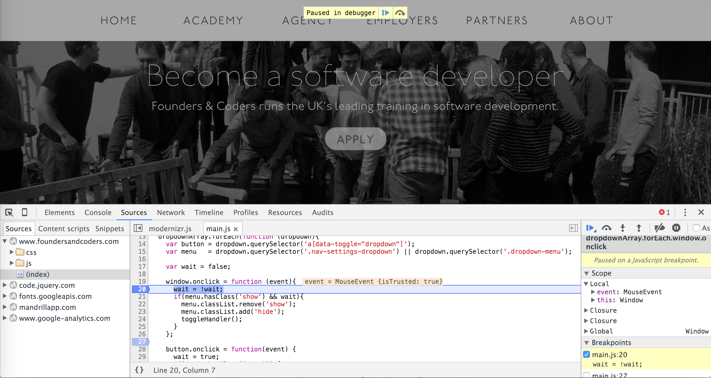

# Developer Tools in the Browser
Most popular browsers today come bundled with a set of tools to aid web developers do their job. Downloadable extensions are also available for other browsers.

Over time, the developer tools bundled with browsers have become more and more sophisticated. The purpose of this README is purely to give a broad overview of the major features; any attempt at completeness is hopeless.

To this end, this README will also focus specifically on the dev tools bundled with Chrome, but much of what is said is also applicable to, for example, Firefox/Opera/IE dev tools.

### Access
In Chrome, developer tools can be accessed with Option-Cmd-I. Refer to the documentation of other browsers/extentions to see how to access developer tools there.

### Layout
The dev tools are tab-grouped by related functionality. For example, HTML elements and CSS styling rules are visible under Elements, the JS console is visible under Console, and so on with file sources, network activity, timeline, CPU load profile information, and DB resources.

### Features
A variety of features are offered that can be helpful to a developer in the process of designing and prototyping a website. The principal features are briefly outlined in this section. For a more detailed description, see the [Chrome Dev Tools Guide](https://developer.chrome.com/devtools).

##### Element Inspection
The developer tools allow the user to inspect the DOM of the website, meaning the tree model of all HTML elements, in addition to any CSS that is attached to those elements.

The correspondence between on-screen visual elements and HTML elements can be seen either by hovering over an element in the Elements view, or by selecting "Inspect" from the context menu when right-clicking on a website.

The style rules that are loaded are displayed dynamically, meaning they can be toggled on and off, altered, and new style rules can be added to quickly explore new styling options without switching back and forth between browser/editor and re-loading the page. Options also exist for:

 Forcing an element state (between :active, :hover, :focus and :visited)

 Slowing animations

Colours may also be selected using the built-in colour-picker by clicking on the colour box before the hex-code of a colour, which means external colour-pickers are unnecessary.

##### JavaScript Console
The JS console is typically used for two purposes:
* To output diagnostic information using the JS `console.log` command.
* To interact with the DOM on-the-fly for prototyping or informal testing purposes.

It may also be used as a general purpose JS REPL. Commands returning DOM elements may be introspected. Any errors generated by the JS included in the page are output to the console and can be inspected there.

##### Debugging JavaScript
Possibly one of the most useful features is the inclusion of an integrated JS debugger. To use this, open the *Sources* tab in the dev tools.

Set breakpoints by clicking on the line-number where you wish to break. Conditional breakpoints can be set by editing an existing breakpoint, and breakpoints may also be set on events.

Then simply interact with the web-page to trigger the execution of the desired piece of code, and the execution will pause at the first breakpoint. Variables in scope will be shown under the *Scope* heading, and can be interacted with using the console.

##### Network Information
Slow sites are annoying at best and unusable at worst. The *Network* tab presents a visualisation of the HTTP requests sent by the browser to the server, logging the content as well as other data like total time elapsed. This allows the developer to quickly isolate any slow to load resources.

##### Links
This README has used the [Chrome Dev Tools Guide](https://developer.chrome.com/devtools) as a source for much of the information.

If you are using another browser, you might find a link for the documentation below. Many features will be common across all implementations.

* [Firefox Dev Tools](https://developer.mozilla.org/en/docs/Tools)
* [Firebug](http://www.getfirebug.com)
* [IE Dev Tools](https://msdn.microsoft.com/en-us/library/dd565628%28v=vs.85%29.aspx)
* [Opera Dragonfly](www.opera.com/dragonfly/)
