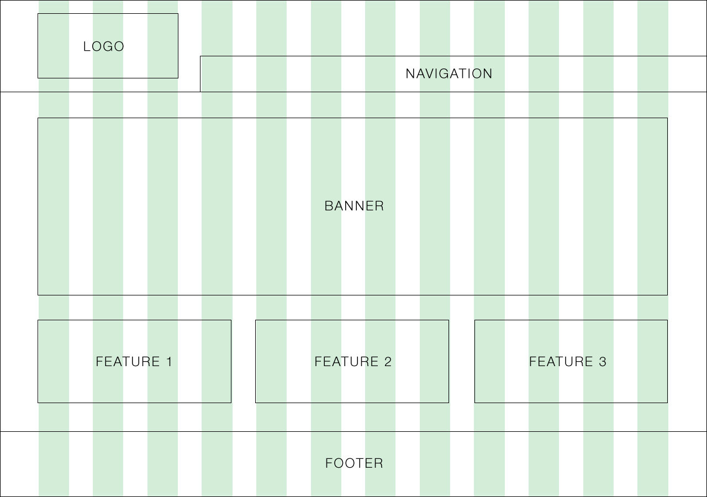
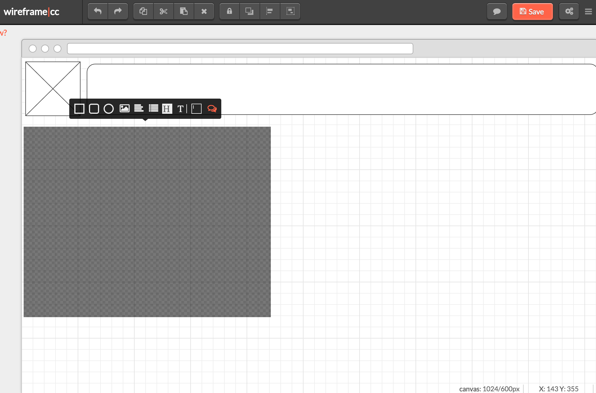
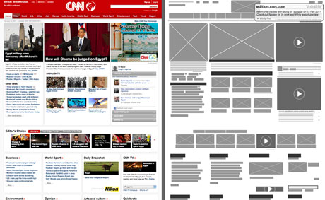

# **WIREFRAMING**

## **WHAT IS IT ??**
Wireframing is a step-by-step which gives a web page its structure and basic design. It does not necessarily involve the use of specific content.
 

 
Example of a web page wireframe

## **WHY IT'S GOOD / WHY YOU NEED IT**
Wireframing will allow a designer to ***produce a web-page mockup*** before going straight to coding.

Wireframing allows you to plan for **hierarchy** and **flow of content**, thus influencing the overall user's experience and interaction.

## **HOW TO DO IT & RELEVANT TOOLS**

* #### Manual Sketching
  * The power of sketches is so underrated!! Some of the **top developers sketch** their designs **on paper** and go straight to code!

* #### Desktop apps

  * **Free**
    * [Cacoo](https://cacoo.com/)
    * [ More here](http://mashable.com/2010/07/15/wireframing-tools/#e9WODxOb5gqr)

  * **Paid** (the majority are...)
    * **[Balsamiq](https://balsamiq.com/products/mockups/)**. I've tried this one and it ***looks pretty nice!***
    * [Axure](http://www.axure.com/)
    * [And many more](http://www.creativebloq.com/wireframes/top-wireframing-tools-11121302)

* #### Online apps

  * **[Wireframe.cc](https://wireframe.cc/gk46NX#about)**
  

  
Screenshot of an attempt at using wireframe.cc

## **RESOURCES**
### *Tutorials*
* [Read this Tuts+ article](http://webdesign.tutsplus.com/articles/a-beginners-guide-to-wireframing--webdesign-7399), and then...
* ***Start doing one yourself!*** I promise you it's **not that hard!!** Start with paper sketches and one of the above-listed apps.

### *Get Inspired*
***Are you a beginner?*** It's okay to get some inspiration from other websites.
Translate a webpage to wireframe with **[Wirify](http://www.wirify.com/)**, like so:

.
